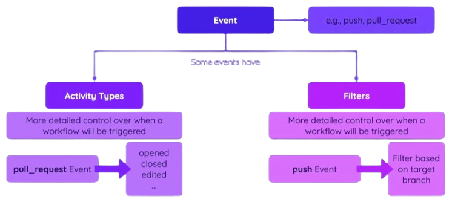

# Github Actions

**EM CONSTRUÇÃO...**

Plataforma de integração contínua e entrega contínua (CI/CD) que permite automatizar fluxos de trabalho de desenvolvimento de software diretamente em seu repositório.

# Workflows, Jobs and Steps


## Workflow

 - Anexado ao repositório GitHub;
 - Contém um ou mais jobs;
 - Iniciado por evento ou manualmente.

## Jobs

 - Define um Runner(ambiente de execução);
 - Contém um ou mais Steps;
 - Pode ser executado paralelamente ou sequencialmente;
 - Pode ter uma condição para ser executado. 

## Steps

  - Executa um shell script ou uma Action;
  - Pode ser customizado;
  - São executados em ordem;
  - Pode ter uma condição.

# Disponibilidade e cobrança

  - Gratuito para repositórios públicos;
  - Limitado para repositórios privados;  
    - https://docs.github.com/en/billing/managing-billing-for-github-actions/about-billing-for-github-actions

## Habilitar a opção Action no repositório

Para habilitar essa opção, siga as instruções do link abaixo.  
https://docs.github.com/en/repositories/managing-your-repositorys-settings-and-features/enabling-features-for-your-repository/managing-github-actions-settings-for-a-repository

## Criação do Workflow

  - Criar um repositório marcando a opção **"ADD a README file"**;
  - No diretório raiz, criar um diretório oculto de nome .github;
  - Acessar esse diretório e criar outro diretório de nome workflows;
  - Acessa esse diretório e criar o arquivo workflow_exemplo.yaml(pode ser qualquer nome);

Arquivo __workflow_exemplo.yaml__  
```yaml
name: Workflow exemplo # Define o nome do workflow
on: workflow_dispatch  # Define o evento que iniciará esse workflow. Manual para essa opção.
jobs:
    job1:
        runs-on: ubuntu-latest # Define o ambiente de execução
        steps:
          - name: Executa o primeiro comando
            run: echo "Mensagem..."
          - name: Executa o segundo comando
            run: |  # Executa multiplas linhas de comando
                echo "Outra mensagem"
                echo "Outra mensagem"
```

  - Efetuar o commit;
  - Acessar a opção Actions no painel do Github;
  - Clicar na opção Workflows.
  - Clicar no botão Run workflow .

## Actions

É uma opção do "GitHub Action" que executa um conjunto de ações complexas e frequentemente repetidas. Essas actions podem ser encontradas nesse endereço: https://github.com/marketplace
No exemplo abaixo, é mostrado um workflow que usa duas actions, sendo: uma para o checkout dos arquivos do repositório e outra nodejs para o build de projetos construídos em NodeJS.

**Exemplo:**
```yaml
name: Usando Actions 
on: [push, workflow_dispatch] # Para múltiplos eventos 
jobs:
    Node_Test:
        runs-on: ubuntu-latest 
        steps:
          - name: Pegar os arquivos do repositório
            uses: actions/checkout@v4 # https://github.com/marketplace/actions/checkout
          - name: Instalar NodeJS
            uses: actions/setup-node@v3
            with:
              node-version: 18
          - name: Instalar as dependências do projeto
            run: npm ci
          - name: Executar alguns testes
            run: npm test
    Node_Deploy:
        needs: Node_Test # Para mais de um, use [job1, job2,...]
        runs-on: ubuntu-latest 
        steps:
          - name: Pegar os arquivos do repositório
            uses: actions/checkout@v4
          - name: Instalar NodeJS
            uses: actions/setup-node@v3
            with:
              node-version: 18
          - name: Instalar as dependências do projeto
            run: npm ci
          - name: Executar o build
            run: npm run build
          - name: Efetuar o deploy
            run: echo "Efetuando o deploy da aplicação..."
              
```

> **Observação:**  
Ao efetuar o push no repositório local, um erro poderá ocorrer, informando a falta de configuração de um Token com as permissões necessárias. Nesse caso, acesse o Github, clique na sua foto localizado no canto superior direito, escolha a opção "settings", "Developer Settings", "Personal access tokens", "tokens(classic)". Crie o token com as opções: **repo** e **workflow**.
Em seguida, execute o push novamente.    

## Workflows e Events

### Tabela de eventos

|PARÂMETRO        | EVENTO |
|:--              |:--     |
|workflow_dispatch|Aciona o workflow manualmente|
|push|Aciona o workflow automáticamente, após o push no repositório| 
|fork| Aciona o workflow após o repositorio ter recebido um Fork|
|watch| Aciona o workflow após a marcação do repositório(star)|
|pull_request| Aciona o workflow após a abertura ou fechamento de um Pull Request|
|issues| Aciona o workflow após a criação ou deleção de uma issue|
|discussion| Aciona o workflow após a criação ou deleção de um comentário|
|create| Aciona o workflow após a criação de uma branch ou tag|
|issue_comment| Aciona o workflow por issue ou pull request|
|repository_dispatch| Aciona o workflow por requisição REST API|
|schedule| Aciona o workflow por agendamento|
|workflow_call| Aciona o workflow através de outro workflow|

Fonte: https://docs.github.com/pt/actions/writing-workflows/choosing-when-your-workflow-runs/events-that-trigger-workflows

### Tipos de eventos e filtros



**Exemplo de eventos:**

__pull_request__

```yaml
name: Exemplo de eventos 
on: 
  pull_request: # Primeiro acionador
    types:
      - opened
  workflow_dispatch: # Segundo acionador
jobs:
. . .
```
Fonte: https://docs.github.com/pt/actions/writing-workflows/choosing-when-your-workflow-runs/events-that-trigger-workflows#pull_request

**Exemplo de filtros:**

__push__

```yaml
name: Exemplo de eventos 
on: 
  pull_request: 
    types:
      - opened
  workflow_dispatch: 
  push: 
    branches:
      - main
      - 'dev-*'
      - 'feat/**' # Permite o caracter / como parte do nome completo
jobs:
. . .
```
Fonte: https://docs.github.com/en/actions/writing-workflows/workflow-syntax-for-github-actions#using-filters

Ignorando a execução do workflow:

```bash
git commit -m "Mensagem [skip ci]"
ou
git commit -m "Mensagem [skip actions]"
```

## Jobs Artifacts e Outputs

### Artefatos

 - Arquivo gerado pelo workflow(.jar .tar, etc );
 - Pode ser realizado o download;
 - Pode ser enviado para um outro Job;
 - Pode ser configurado o tempo de retenção.

```yaml
. . . 
    Build:
      needs: Node_Test 
        runs-on: ubuntu-latest 
        steps:
          - name: Pegar os arquivos do repositório
            uses: actions/checkout@v4
          - name: Instalar as dependências do projeto
            run: npm ci
          - name: Criar artefato do projeto
            run: npm run build
          - name: Armazenar o artefato
            uses: actions/upload-artifacts@v3
            with:
              name: dist-files # Nome do artefato
              path: dist # Nome do diretório
. . .

```
falta exemplo para pegar o artefato....


### Cache de dependência

```yaml
. . . 
    Node_Test:
        runs-on: ubuntu-latest 
        steps:
          - name: Pegar os arquivos do repositório
            uses: actions/checkout@v4
          - name: Cache de dependencias
            uses: actions/checkout@v4
            with:
              path: ˜/.npm
              key: deps-node-modules-${{ hashFiles('**/package-lock.json') }}
. . .

    Build:
      needs: Node_Test
        runs-on: ubuntu-latest 
        steps:
          - name: Pegar os arquivos do repositório
            uses: actions/checkout@v4
          - name: Cache de dependencias
            uses: actions/checkout@v4
            with:
              path: ˜/.npm
              key: deps-node-modules-${{ hashFiles('**/package-lock.json') }}
          - name: Instalar as dependências do projeto
            run: npm ci
          - name: Criar artefato do projeto
            run: npm run build
```

### Environments, Variables e Secrets

```yaml
name: Deployment
on:
  push:
    branches:
      - main
      - dev
env:
  MONGODB_DB_NAME: database_name
  PORT: 8080
jobs:
  test:
    env: 
      MONGODB_CLUSTER_ADDRESS: ip_cluster
      MONGODB_USERNAME: username
      MONGODB_PASSWORD: password
    runs-on: ubuntu-latest
    steps:
      - name: Get Code
        uses: actions/checkout@v3
      - name: Cache dependencies
        uses: actions/cache@v3
        with:
          path: ~/.npm
          key: npm-deps-${{ hashFiles('**/package-lock.json') }}
      - name: Install dependencies
        run: npm ci
      - name: Run server
        run: npm start & npx wait-on http://127.0.0.1:$PORT
      - name: Run tests
        run: npm test
      - name: Output information
        run: |
          echo "MONGODB_USERNAME: ${{env.MONGODB_USERNAME}}"
  deploy:
    needs: test
    runs-on: ubuntu-latest
    steps:
      - name: Output information
        run: |
          echo "MONGODB_USERNAME: ${{env.MONGODB_USERNAME}}"
```


<div align="center"><center><h6>:rocket: Go Devops... !!!</center></div>