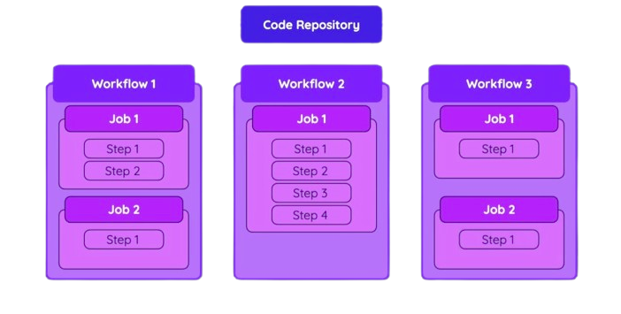

# Github Actions

**EM CONSTRUÇÃO...**

Plataforma de integração contínua e entrega contínua (CI/CD) que permite automatizar fluxos de trabalho de desenvolvimento de software diretamente em seu repositório.

# Workflows, Jobs and Steps



## Workflow

 - Anexado ao repositório GitHub;
 - Contém um ou mais jobs;
 - Iniciado por evento ou manualmente.

## Jobs

 - Define um Runner(ambiente de execução);
 - Contém um ou mais Steps;
 - Pode ser executado paralelamente ou sequencialmente;
 - Pode ter uma condição para ser executado. 

## Steps

  - Executa um shell script ou uma Action;
  - Pode ser customizado;
  - São executados em ordem;
  - Pode ter uma condição.

# Disponibilidade e cobrança

  - Gratuito para repositórios públicos;
  - Limitado para repositórios privados;
    - https://docs.github.com/en/billing/managing-billing-for-github-actions/about-billing-for-github-actions

## Habilitar a opção Action no repositório

Para habilitar essa opção, siga as instruções do link abaixo.
https://docs.github.com/en/repositories/managing-your-repositorys-settings-and-features/enabling-features-for-your-repository/managing-github-actions-settings-for-a-repository

## Criação do Workflow

  - Criar um repositório marcando a opção **"ADD a README file"**;
  - No diretório raiz, criar um diretório oculto de nome .github;
  - Acessar esse diretório e criar outro diretório de nome workflows;
  - Acessa esse diretório e criar o arquivo workflow_exemplo.yaml(pode ser qualquer nome);

Arquivo __workflow_exemplo.yaml__  
```bash
name: Workflow exemplo # Define o nome do workflow
on: workflow_dispatch  # Define o evento que iniciará esse workflow. Manual para essa opção.
jobs:
    job1:
        runs-on: ubuntu-latest # Define o ambiente de execução
        steps:
          - name: Executa o primeiro comando
            run: echo "Mensagem..."
          - name: Executa o segundo comando
            run: echo "Outra mensagem"
```

  - Efetuar o commit;
  - Acessar a opção Actions no painel do Github;
  - Clicar na opção Workflows.
  - Clicar no botão Run workflow .

